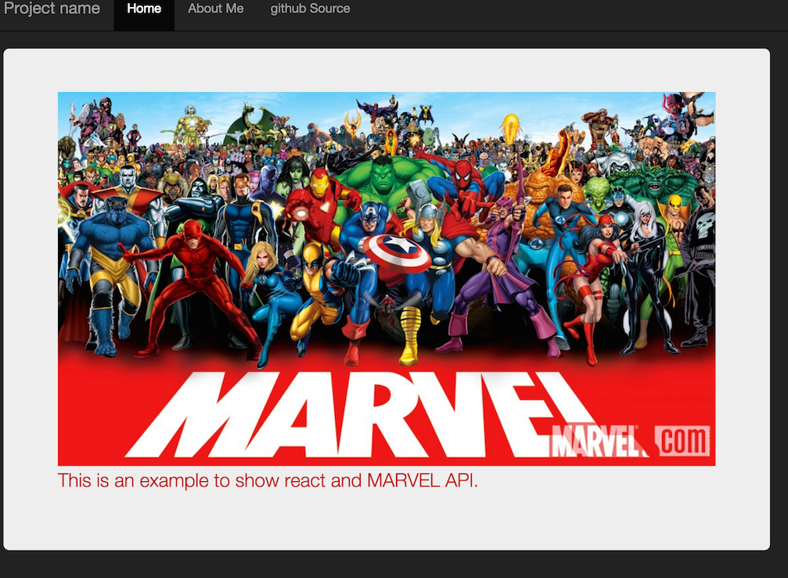
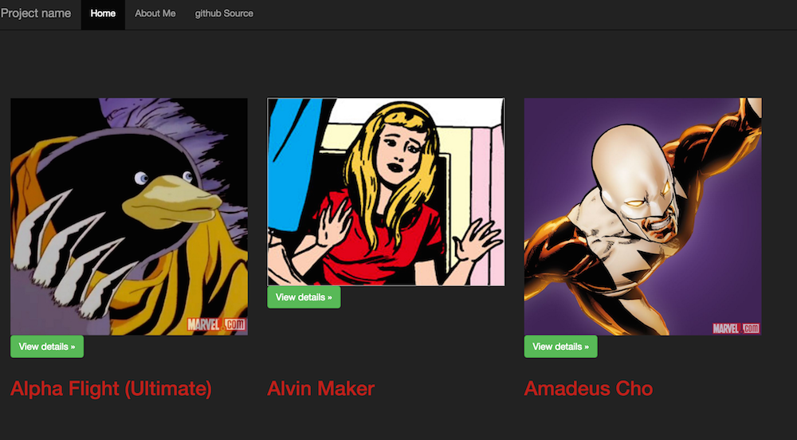

# react-marvel
> This repos is using reactJS from facebook and MARVEL API

All the marvel data is fetched from MARVEL, using their open API, here is more about it, [MARVEL open API](http://developer.marvel.com/), the appliuaction was builded using [react](https://facebook.github.io/react/).

Here are some screen shots:

